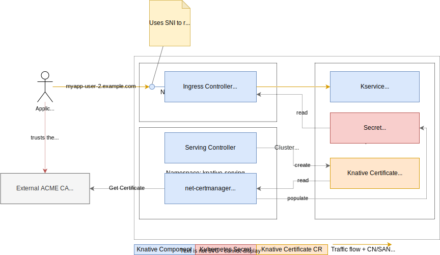

# Knative Serving Encryption

⛔️ Warning: not everything is implemented, as Knative Serving encryption is still a work-in-progress. Tracking-issue: https://github.com/knative/serving/issues/11906.

## Overview
There are three parts to Knative Serving encryption
* (1) HTTPS on the ingress layer _external_ to the cluster (cluster external domain, like `myapp-<namespace>.example.com`).
* (2) HTTPS on the ingress layer _internal_ to the cluster (cluster local domains, like `myapp.<namespace>.svc.cluster.local`).
* (3) HTTPS between Knative internal components (`ingress-controller`, `activator`, `queue-proxy`).

📝 Note: currently all control-plane traffic (including Kubernetes PreStopHooks and metadata like metrics) are not (yet) encrypted.

## The parts in detail
The different parts are independent of each other and (can) use different Certificate Authorities to sign the necessary certificates.

### (1) External domain

* Certificate CN/SAN contains the external domain of a Knative Service, e.g. `myapp-<namespace>.example.com`.
* The certificates are hosted using SNI by the external endpoint of the ingress-controller.
* The caller has to trust the (external) CA that signed the certificates (this is out of the scope of Knative).
* These certificates are either [provided manually](https://knative.dev/docs/serving/using-a-tls-cert/) or by using an implementation to the `Knative Certificate` abstraction. Currently, we support two implementations:
  * [net-certmanager](https://github.com/knative-extensions/net-certmanager) 
  * [net-http01](https://github.com/knative-extensions/net-http01)
* Please refer to the [documentation](https://knative.dev/docs/serving/using-auto-tls/) for more information.

### (2) Cluster-local certificates

* Certificate CN/SAN contains the cluster-local domain of a Knative Service, e.g. `myapp.namespace.svc.cluster.local`, `myapp.namespace.svc`, `myapp.namespace`.
* The certificates are hosted using SNI by the cluster-local endpoint of the ingress-controller.
* The caller has to trust the CA that signed the certificates. Knative exposes the CA certificates in the `status.address.CACerts` field of each `Knative Service` (⛔️ not yet implemented, see https://github.com/knative/serving/issues/14196). Each callee has to make sure that it trusts that CA.
* These certificates are provided using an implementation to the `Knative Certificate` abstraction with [visibility label](https://github.com/knative-extensions/net-certmanager/blob/main/pkg/reconciler/certificate/resources/cert_manager_certificate.go#L115) `cluster-local`. Currently, we support two implementations:
  * Knative integrated CA (will be embedded in Serving Controller - ⛔️ not implemented yet)
  * [net-certmanager](https://github.com/knative-extensions/net-certmanager) (⛔️ not usable yet)

### (3) Knative internal certificates

* Certificates for Knative internal components (`ingress-controller`, `activator`, `queue-proxy`) are automatically provided and managed transparently by:
  * Knative integrated CA (embedded in [Serving Controller](../../cmd/controller/main.go)).
* Specific SANs are used to verify each connection. 
* Each component automatically registers and trusts the Knative integrated CA.
* Note: the Knative integrated CA uses a different CA for cluster-local certificates to not mix internal certificates with the ones that are visible to the user.

